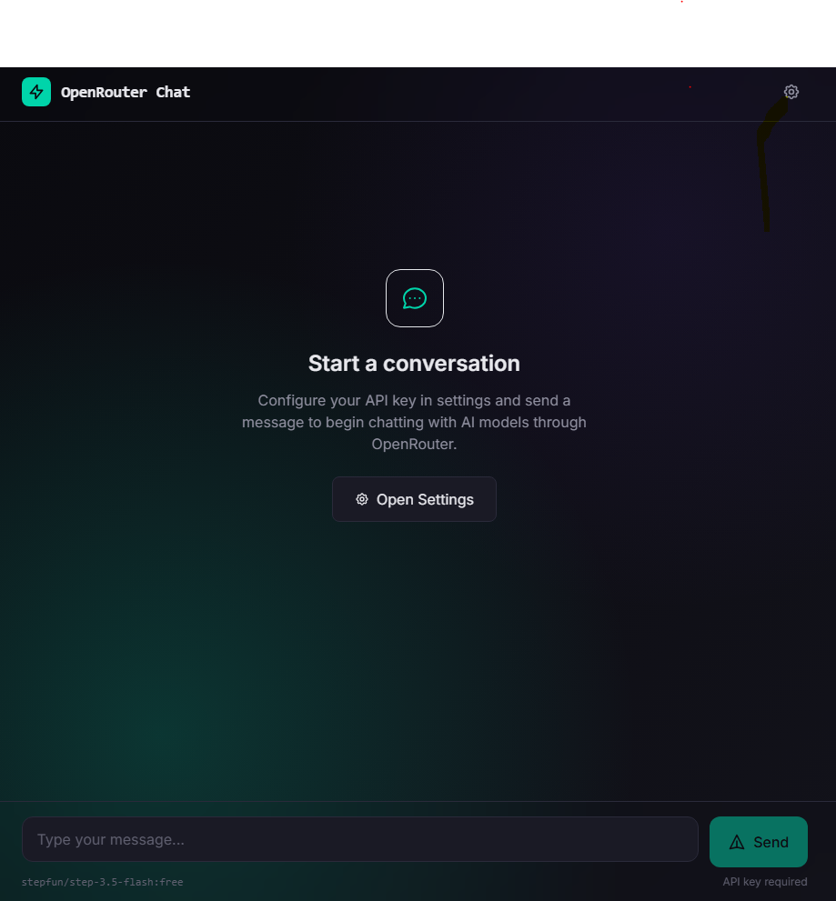
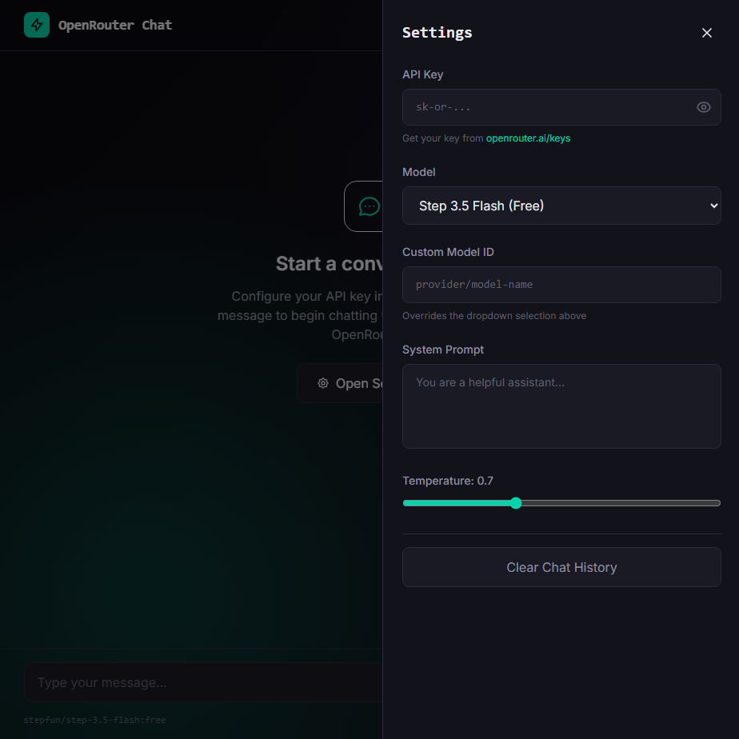

## Free AI Chatbot using OpenRouter API - Run LLMs locally free without hosting on your machine

A lightweight, privacy-focused, single-page chat interface that connects to the OpenRouter API. This project allows users to interact with various AI models (including free ones) without needing a backend server or complex setup.

HTML5/Tailwind CSS/JavaScript

## Project Intentions

The goal of this project is to provide a simple, accessible, and cost-effective way for anyone to interact with Large Language Models (LLMs).

## Zero Cost, Zero Setup: By utilizing the OpenRouter API and free-tier models (like stepfun/step-3.5-flash:free), users can chat with AI without paying subscription fees or setting up complex backend infrastructure.

Privacy First: The application runs entirely in your browser. Your API keys and chat history are stored locally on your device (Local Storage) and are never sent to a third-party server.
Simplicity: Built as a single HTML file with no build steps or dependencies to install. Just download and open in a browser.

## Model Flexibility: OpenRouter provides access to hundreds of models. This interface allows users to switch between models (Claude, GPT-4, Llama, etc.) or input custom model IDs instantly.

## Features

Single File Architecture: No node_modules, no build commands. Just one HTML file.
OpenRouter Integration: Connect to any model available on OpenRouter.

## Configurable Settings:

Model Selection (Dropdown + Custom ID input).
System Prompt customization.
Temperature control.
Persistent Settings: Your API key and preferences are saved in your browser.
Responsive Design: Works on desktop and mobile devices.
Markdown Support: Renders code blocks, lists, and bold text in responses.

## How to Use

Get an API Key:
Go to OpenRouter.
Sign up and generate an API Key.
Run the Application:
Download the index.html file from this repository.
Open it in any modern web browser (Chrome, Firefox, Edge, Safari).

## Configure:

Click the Settings (Gear Icon) in the top right.
Paste your OpenRouter API Key.
Select a model (Default: Step 3.5 Flash (Free)).
 

Chat:
Type your message and press Enter.

## Limitations & Drawbacks

While this project is great for personal use and quick testing, it has inherent limitations due to its client-side only architecture:

Chat History is Not Persistent:
Currently, the chat history is stored in a JavaScript variable. If you refresh the page or close the tab, the conversation is lost. (Note: Settings/API Key are saved).
Client-Side Security:
Since this runs in the browser, the API key is stored in the browser's Local Storage. While convenient, this is not as secure as a server-side environment (like a .env file). Do not share your computer screen or Local Storage data with untrusted parties.
Rate Limits:
Free models on OpenRouter have strict rate limits. If you send messages too quickly, you may encounter errors.
Browser Dependency:
JavaScript must be enabled. It will not work in environments where external scripts (like Tailwind CSS CDN) are blocked.
Basic Markdown Rendering:
The markdown parser is regex-based and may not render complex tables or nested HTML perfectly compared to full libraries like marked.js.

## Contributing

Contributions are welcome! If you have ideas for improving the UI, adding chat history persistence (e.g., using IndexedDB), or fixing bugs, feel free to:

Fork the repository.
Create a new branch (git checkout -b feature/improvement).
Commit your changes.
Open a Pull Request.
License

## This project is open source and available under the MIT License.
